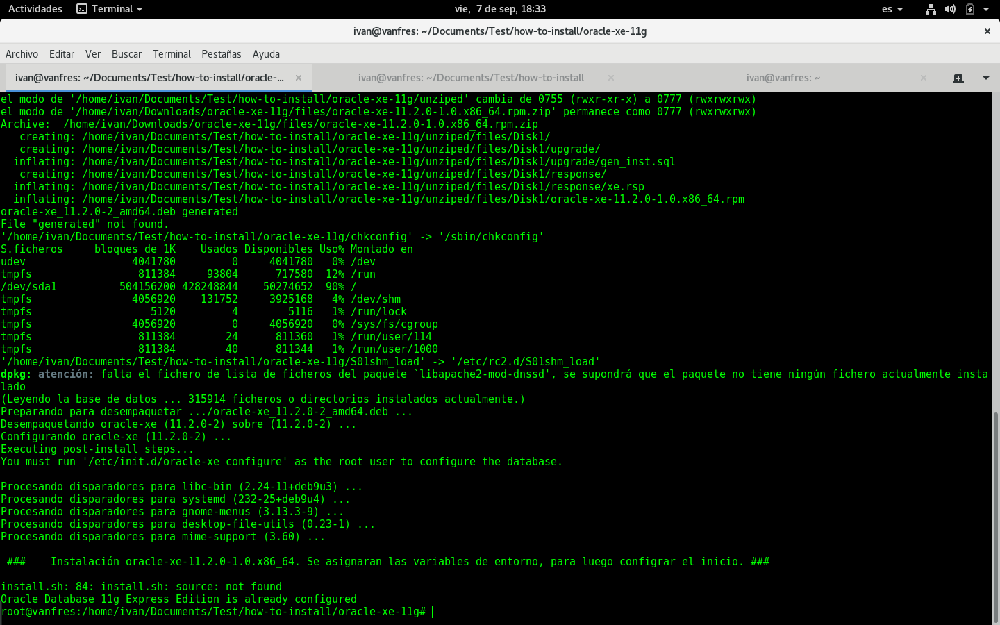

## Pasos para instalar Oracle 11g XE en Debian ##

	# Path donde se almacena el archivo
	MY_ORACLE_DOWNLOAD='/home/ivan/Downloads/oracle-xe-11g/files'
	
	# Path del archivo install.sh, actualizar, si se mueve de PATH
	PATH_ORACLE_INSTALL='/home/ivan/Documents/Test/how-to-install/oracle-xe-11g'

	# Nombre del archivo
	ORACLE_FILE_NAME='oracle-xe-11.2.0-1.0.x86_64'
	

	# En este caso se asigna globalmente
	# Pero puede inicialo desde el home de su usuario ~/.bashrc
	# y compilarlo para cada uso
	BASHRC='~/bashrc'

### Verificar que el archivo que se asigno al path BASHRC cuente con estas varibles definidas (Si no las copió, copiarlas) ### 

	export ORACLE_HOME=/u01/app/oracle/product/11.2.0/xe
	export ORACLE_SID=XE
	export NLS_LANG=$ORACLE_HOME/bin/nls_lang.sh
	export ORACLE_BASE=/u01/app/oracle
	export LD_LIBRARY_PATH=$ORACLE_HOME/lib:$LD_LIBRARY_PATH
	export PATH=$ORACLE_HOME/bin:$PATH

### Iniciar el servicio del Oracle XE ###
	service oracle-xe start

	# Si el servicio esta iniciado, ejecute el siguiente comando y 
	# vuelva a iniciarlo
	service oracle-xe stop

